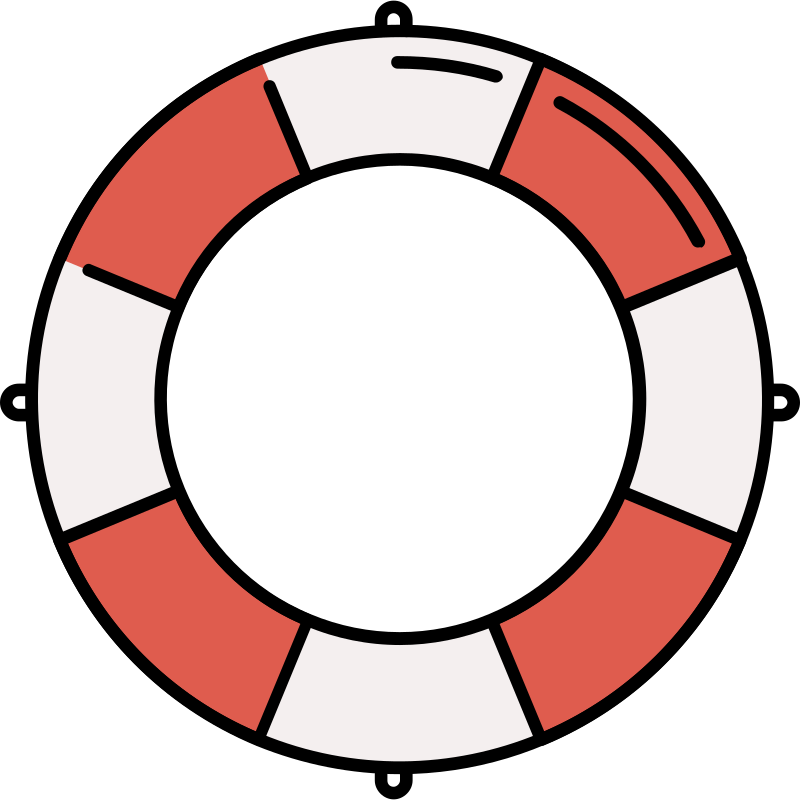

# Welcome to WireMock .NET

  WireMock .NET is a powerful .NET library for API mock testing. It's the .NET 
  implementation of the popular WireMock tool, providing API simulation capabilities
  for testing, development, and integration scenarios. Create stable test environments,
  isolate from unreliable third-party services, and simulate APIs that don't exist yet.

<h2>Getting Started</h2>

  <a class="card" href="What-Is-WireMock.Net/">
    
    Overview
  </a>
  <a class="card" href="Using-WireMock-in-UnitTests/">
    
    Quick Start
  </a>
  <a class="card" href="https://www.nuget.org/packages/WireMock.Net/" target="_blank">
    
    NuGet Package
  </a>
  <a class="card" href="References/">
    
    Get Help
  </a>

<h2>Deployment Options</h2>

  WireMock.Net provides multiple deployment options for different scenarios,
  from unit testing to standalone services and cloud deployments.

  <a class="card" href="Using-WireMock-in-UnitTests/">
    
    Unit Testing
  </a>
  <a class="card" href="WireMock-as-a-standalone-process/">
    
    Standalone Process
  </a>
  <a class="card" href="WireMock-as-dotnet-tool/">
    
    .NET Tool
  </a>
  <a class="card" href="WireMock-as-a-Windows-Service/">
    
    Windows Service
  </a>
  <a class="card" href="WireMock-as-a-(Azure)-Web-App/">
    
    Azure Web App
  </a>
  <a class="card" href="Using-WireMock.Net.Testcontainers/">
    
    Testcontainers
  </a>

<h2>Key Features</h2>

  Explore WireMock.Net's powerful features for comprehensive API mocking and testing.

  <a class="card card-use-case" href="Request-Matching/">
    
    Advanced request matching
  </a>
  <a class="card card-use-case" href="Response-Templating/">
    
    Dynamic response templating
  </a>
  <a class="card card-use-case" href="Stubbing/">
    
    HTTP API stubbing
  </a>
  <a class="card card-use-case" href="Faults/">
    
    Fault and latency injection
  </a>
  <a class="card card-use-case" href="Scenarios-and-States/">
    
    Scenarios and state management
  </a>
  <a class="card card-use-case" href="Proxying/">
    
    HTTP proxying
  </a>

