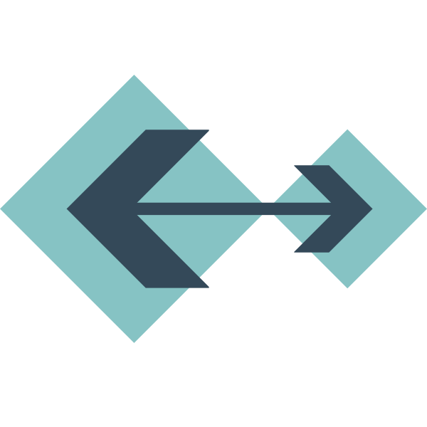
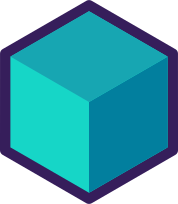

# WireMock Java

  WireMock is a popular open-source tool for API mock testing, with over 5
  million downloads per month. It can help you to create stable test and
  development environments, isolate yourself from flakey 3rd parties and
  simulate APIs that don't exist yet.

<h2>Getting Started</h2>

  <a class="card" href="overview/">
    
    Overview
  </a>
  <a class="card" href="getting-started/">
    
    Quick Start
  </a>
  <a class="card" href="download-and-installation/">
    
    Download
  </a>
  <a class="card" href="support">
    
    Get Help
  </a>

<h2>Distributions</h2>

  WireMock provides the following generic distributions that allow running it as
  a
  <a href="standalone/">standalone server</a>
  in a container or within a Java Virtual Machine.

  <a class="card" href="/standalone/">
    
    Standalone JAR
  </a>
  <a class="card" href="/standalone/docker/">
    
    Docker
  </a>
  <a class="card" href="solutions/kubernetes/">
    
    Helm (Experimental)
  </a>
  <a
    class="card"
    href="https://www.wiremock.io/cloud-overview?utm_medium=referral&utm_sourcewiremock.org&utm_content=docs_nav"
    target="_blank"
  >
    
    WireMock Cloud (commercial SaaS)
  </a>
  <a class="card" href="https://www.npmjs.com/package/wiremock" target="_blank">
    
    NPM
  </a>

<h2>By use-case</h2>

  Below you can find links to the documentation for WireMock key use-cases. You
  can find more documentation pages on the sidebar.

  <a class="card card-use-case" href="request-matching/">
    
    Advanced request matching
  </a>
  <a class="card card-use-case" href="response-templating/">
    
    Dynamic response templating
  </a>
  <!-- TODO: replace by a generic test framework listing -->
  <a class="card card-use-case" href="junit-jupiter/">
    
    Use API Mocking in your unit tests
  </a>
  <a class="card card-use-case" href="simulating-faults/">
    
    Fault and latency injection
  </a>
  <a class="card card-use-case" href="record-playback/">
    
    Record / Playback
  </a>
  <!-- On the landing but no Root page
    <a class="card card-use-case" href="./">
        
        Java, Python, HTTP and JSON file APIs
    </a>
    -->
  <a class="card card-use-case" href="mock-api-templates/">
    
    Use pre-defined Mock API templates
  </a>
  <a class="card card-use-case" href="extending-wiremock/">
    
    Extending WireMock
  </a>

<h2>By protocol</h2>

  WireMock can serve all HTTP-based protocols and REST API. Through built-in
  features and extensions, it provides additional capabilities for widely used
  protocols.

  <a class="card" href="webhooks-and-callbacks/">
    
    Webhooks and Callbacks
  </a>
  <a class="card" href="https/">
    
    HTTPs
  </a>
  <a class="card" href="grpc/">
    
    gRPC
  </a>
  <a class="card" href="solutions/graphql/">
    
    GraphQL
  </a>

<h2>By technology</h2>

  There are also solutions and guides for particular technologies and
  frameworks, provided by the WireMock community and external contributors.

  <a class="card" href="solutions/jvm/">
    
    Java and JVM
  </a>
  <a class="card" href="solutions/python/">
    
    Python
  </a>
  <a class="card" href="solutions/spring-boot-integration/">
    
    Spring Boot
  </a>
  <a class="card" href="solutions/nodejs/">
    
    Node.js
  </a>
  <a class="card" href="solutions/android/">
    
    Android
  </a>
  <a class="card" href="/dotnet/">
    
    .NET
  </a>
  <a class="card" href="solutions/golang/">
    
    Golang
  </a>
  <a class="card" href="solutions/rust/">
    
    Rust
  </a>
  <a class="card" href="solutions/groovy/">
    
    Groovy
  </a>
  <a class="card" href="solutions/kotlin/">
    
    Kotlin
  </a>
  <a class="card" href="solutions/kubernetes/">
    
    Kubernetes
  </a>
  <a class="card" href="solutions/testcontainers/">
    
    Testcontainers
  </a>
  <a class="card" href="solutions/quarkus/">
    
    Quarkus
  </a>
  <a class="card" href="solutions/c_cpp/">
    
    C/C++
  </a>

